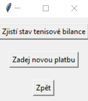
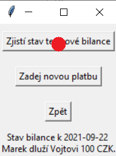

# TENISOVÁ APLIKACE # 
Cílem tohoto projektu je vytvořit GUI v jazyce Python, které bude sloužit jako "dlužníček" dvou nadšených tenisových hráčů, Marka a Vojty :-). 

## Verze ##
### Verze 1.0 ###
1. Funguje tlačítko "Zjistí stav tenisové bilance": 

### Úvodní obrazovka ###
  

### Zjisti stav tenisové bilance ###
  

2. Funguje tlačítko "Zpět".
3. Tlačítko "Zadej novou platbu" zatím není aktivní.

## Poznámka ##
Jak nastavit Google sheet je popsáno zde: https://medium.com/analytics-vidhya/how-to-read-and-write-data-to-google-spreadsheet-using-python-ebf54d51a72c

## Použité externí knihovny ##
pandas, googleapiclient, google_auth, google-spreadsheet
